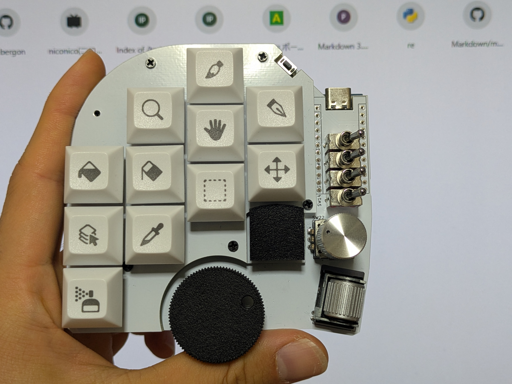
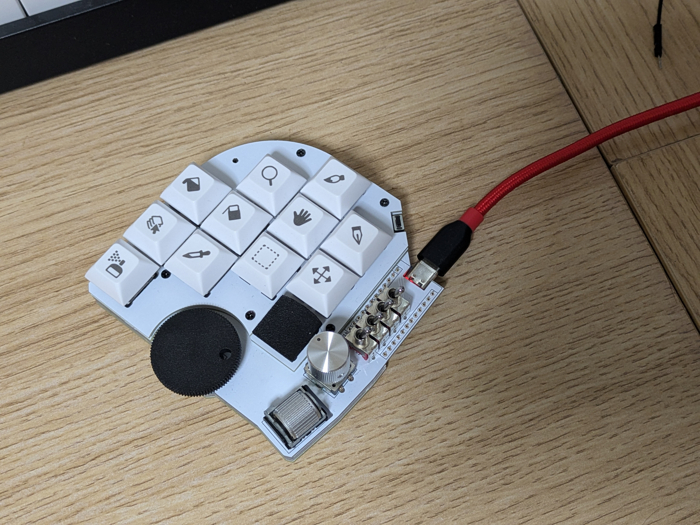

# 自作キーボード MultipleKeyboard ビルドガイド
## MultipleKeyboardとは?

テキストエディターのVim と 白銀ラボ様のKeyball61 に強く影響を受け作ったキーボードです。 
左手のホームポジションを強く意識し、手を大きく動かさずに3つのロータリエンコーダにアクセスすることを重視しています。

## キットの販売場所
## キット以外に必要なパーツ
## 組み立てに必要な道具

## Author
ambergon

