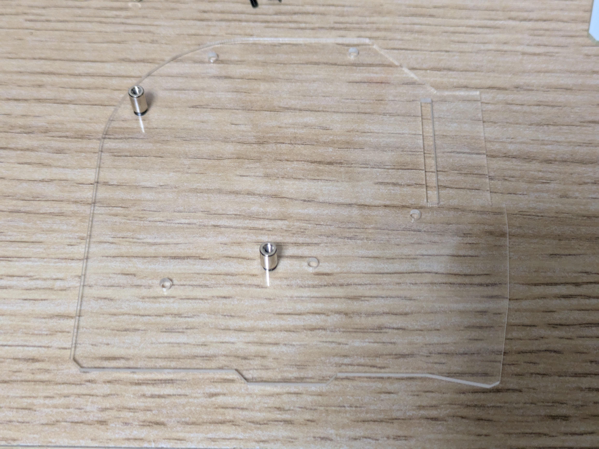
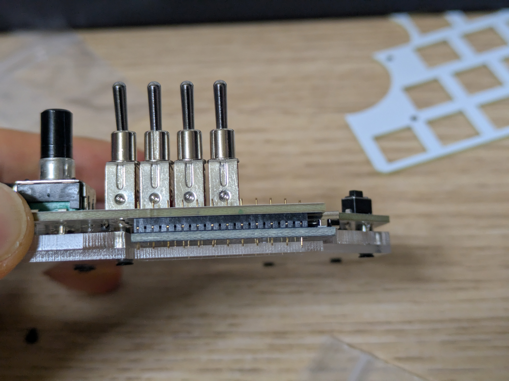

# 自作キーボード MultipleGlove BuildGuid
自作キーボード / MultipleGlove の紹介と作り方

## 必要な道具
- はんだごて
- はんだ
- ペンチ(小)
- ニッパー
- プラスドライバー(小) 
- 六角( 別売りの ロータリーエンコーダノブに使用)

- セロテープ(必須ではない。)

## 自作キーボードキットに含まれているもの

|名称                           |個数|
|-------------------------------|----|
|Cherry MX  プレート            |1   |
|Kailh Choc プレート            |1   |
|PCB プレート                   |1   |
|アクリルボトムプレート         |1   |
|アクリルミドルプレート         |1   |
|                               |    |
|M2ネジ 4mm                     |14  |
|M2スペーサ 6.5mm               |2   |
|M2スペーサ  10mm               |5   |
|                               |    |
|Cherry MX    ソケット          |11  |
|Kailh Choc V1ソケット          |1   |
|                               |    |
|RESET用タクトスイッチ          |1   |
|平型ダイオード                 |17  |
|トグルスイッチ                 |4   |
|                               |    |
|ロータリーエンコーダ           |1   |
|ロータリーエンコーダ( 低 )     |1   |
|ロータリーエンコーダ( 低 ) ノブ|1   |
|水平ロータリーエンコーダキット |1   |
|                               |    |
|                               |    |
|Kailh Choc V1 キーキャップ     |1   |
|                               |    |
|                               |    |
|ゴム足                         |4   |

## キット以外に必要なモノ
|名称                      |個数|入手先                                                                                                  |備考                                                          |
|--------------------------|----|--------------------------------------------------------------------------------------------------------|--------------------------------------------------------------|
|Pro Micro                 |1   |`https://shop.yushakobo.jp/products/3905?_pos=3&_sid=2d2645273&_ss=r`                                   |Micro B版でも可                                               |
|ロータリーエンコーダ ノブ |1   |`https://shop.yushakobo.jp/products/3733?_pos=1&_sid=b6c41e497&_ss=r`                                   |本キットにはノブは含まれていません。                          |
|Cherry MX互換キーキャップ |11  |`https://shop.yushakobo.jp/products/6892?_pos=1&_sid=40a929f2d&_ss=r`                                   |MX互換なら何でもよい。リンクは個人的おすすめ                  |
|Cherry MX互換キースイッチ |11  |`https://shop.yushakobo.jp/products/3754?_pos=2&_sid=762338812&_ss=r`                                   |Durock Silent Linear Dolphinは重くて指をのせても沈みずらい。ホームポジションにおすすめ。|
|Kailh Choc v1 キースイッチ|1   |`https://shop.yushakobo.jp/products/pg1350`                                                             |あまり押さない場所なので軽いスイッチだとよい。|

## 必須ではないが追加出来るモノ
|名称                      |個数|入手先                                                                                                  |備考                                 |
|--------------------------|----|--------------------------------------------------------------------------------------------------------|-------------------------------------|
|コンスルー                |1   |`https://shop.yushakobo.jp/products/31?srsltid=AfmBOoqSEKSEJ1zkLMcCqmUm71_qwLIZnZuZTLdCreHNjBVHFqgY4oqC`|Pro Microが壊れた際に交換しやすくなる。注意点として外れやすい。このページで使用しているのは2.5mmの物。|
|Kailh Choc v1 キーソケット|11  |`https://shop.yushakobo.jp/products/a01ps?variant=37665172553889`                                      |ロープロファイル化する場合。|
|Kailh Choc v1 キーキャップ|11  |`https://shop.yushakobo.jp/products/pg1350cap-blank?_pos=4&_fid=11f56dc3b&_ss=c&variant=37665716240545`|ロープロファイル化する場合。|
|Kailh Choc v1 キースイッチ|11  |`https://shop.yushakobo.jp/products/pg1350`                                                            |ロープロファイル化する場合。|

## キットの注意事項
3Dプリント製の30mmロータリーエンコーダ(低)ノブは、精度の都合エンコーダに取り付けた状態で提供しています。
若干の傾き等がある場合があります。
水平ロータリーエンコーダの片側についてはノンクリック仕様に変更する為、一度分解しています。

## 組み立て
開封し、すべてあるか確かめる。

### はんだづけ
はんだごてを温める。
ダイオードをあけて適当な容器にとる。
(回転させたりひっくり返したりできると楽。)

17箇所あるダイオードを乗せるところのうち片側にはんだをのせる。

ペンチでダイオードをつかみ、のせたはんだにあてがったまま反対側の手でのせたはんだを温めてつける。

ダイオードには向きがあるので基板のプリントに合わせる注意。

すべてのダイオードを取り付け、向きに問題が無ければ反対側の足をすべてはんだ付けする。

黒枠で囲ってあるところを、Kailh Choc V1 用のソケットを取り付ける。

ダイオードと同じように片側にはんだをのせ、ソケットの片足を取り付ける
ソケットをのせて指で軽く押さえながら、、はんだをのせた部分をはんだごてで軽く押すと取り付けることが出来る。

ソケットが浮いていないことを確認し、反対側も取り付ける。

浮いているソケットの例

Cherry MX 用のソケットを取り出し、黒い四角でおおわれていない箇所すべてに取り付ける。

全体が問題なければロータリーエンコーダ(低)を取り出し、 『『表側』』に取り付けまた裏返す。
片足をはんだ付けし、角度など問題なければ、すべてはんだ付けする。

水平ロータリーエンコーダを取り出し表側に仮置きする。
この際、銀のプレートがあるエンコーダ(回転させたとき抵抗がある方)を上に取り付ける。

垂直に乗っていること・回転時に干渉しないを確認し、はんだ付けする。
鑑賞する場合は中央側に軸をずらす。

通常のロータリーエンコーダを取り付ける。
リセット用のタクトスイッチを表に取り付ける。

トグルスイッチを取り出し、表に取り付ける。
必要であればセロテープで仮止めする。

取り付けた後、ニッパーでトグルスイッチの足を根元のあたりで切る。

Pro Microを取り付ける。(画像ではコンスルー(別売り)を使用している。)端子側が表側になるようにする。

はんだごての使用はここまで。

### 組み立てる。
アクリルの保護シートをすべて剥がす。
ネジとスペーサを取り出し、小さいほうのスペーサを以下のように取り付ける。

その後残りのスペーサを組み付ける。

下から、スペーサを取り付けたアクリル板、残りのアクリル板、はんだ付けしたPCBプレートをのせる。

Kailh Choc V1 キースイッチ(別売り)に専用キーキャップを取り付ける。( Choc V1は端子が手前側に来るようにする。)
(キーキャップが個体により入りずらく、また脆いので優しく)

大きい方のトッププレートに取り付け、組み立てたものに重ねる。

この際傾いていないか、正常に足がはまっているか確認する。

問題なければねじ止めする。

残りのプレートをのせ、
問題なければねじ止めする。

ロータリーエンコーダのノブを取り付ける。(少し高い位置にすると体感使いやすい。)
お好みのキースイッチとキーキャップを取り付ける。
ゴム足を四つ取り付ける。
裏面から見て、ソケットにピンが刺さっているか確認し、問題なければ完成。

## Pro Microに書き込む
トグルスイッチをすべて右に倒してからUSBでPro MicroとPCを接続し、[MultipleGlove - Remap](https://remap-keys.app/catalog/bEgsaoLpNA3LOYdreG0p/firmware)にアクセスする。
FLASHボタンを押す。

初期状態のPro Microを接続するとダイアログが出る。接続ボタンを押す。
既に何か書き込まれているPro Microを使用する場合はリセットボタンを素早く二回押す。

書き込みここまで。

## キーマップを変更する。
[Remap](https://remap-keys.app/configure)

## MultipleGloveの独自仕様/トグルスイッチ
ビット演算

## キットの販売場所

## 注意点
コンスルーを使用する場合、アクリルとの隙間があり、ゆるみやすい
一部のキーの反応がない場合などは疑ってください。

## Author
ATSUTO NAKAYAMA( ambergon )

